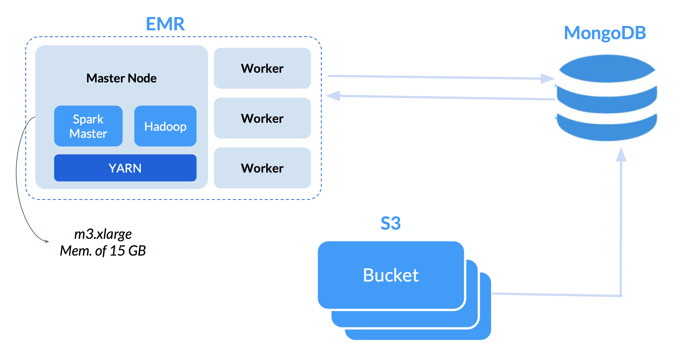
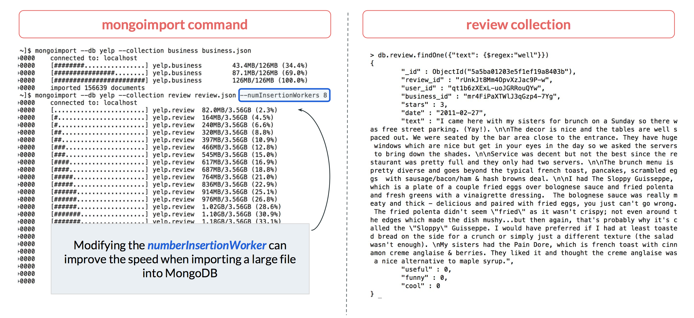
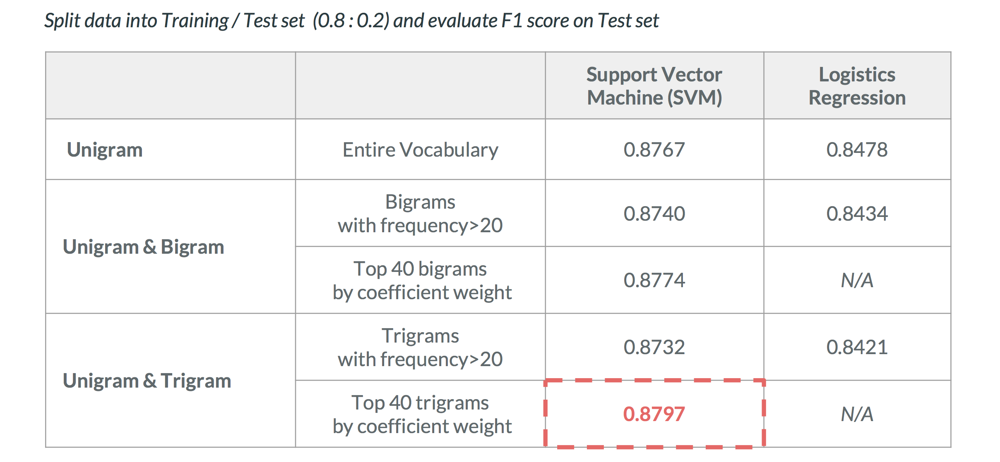
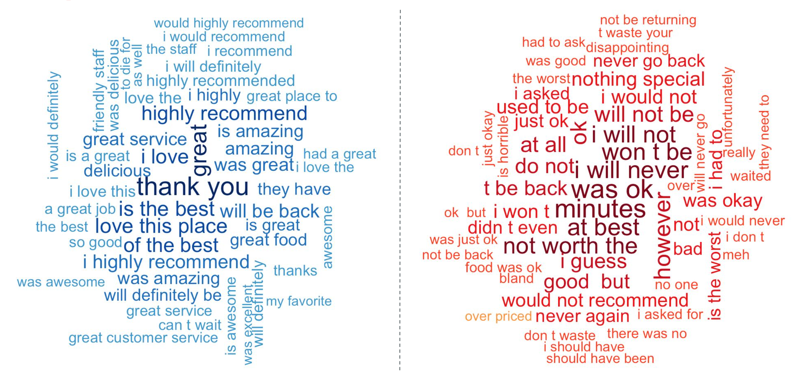

# **Yelp Review Sentiment Analysis using Distributed Computing**


*The project was completed with the group of Nicha Ruchirawat, Tina GongTing Peng and Maise Ly*

## Problem Statement
Classifiy Yelp reviews as positive / negative and identify most relevant phrases based on the textual content using bags of words, tf-idf, SVM and Regularized Logistic Regression.

## Data Pipeline
The model will be implemented on a YARN cluster of four nodes (three workers and one master). The YARN cluster was set up using AWS EMR, each machine has 8 cores and 15GB memory.



The original dataset is obtained via the [Yelp Data Challenge](https://www.yelp.com/dataset/challenge), from which we only used the review json file of 3.82GB. The data is stored in an Amazon S3 bucket before it was imported to the mongoDB on the EC2 instance.   



The data was then loaded into Spark and the model was implemented using Spark MLib and Spark SQL.

## Build a Model

We loaded the data into Spark via the use of Spark-Mongo-Connector packages. Noted that, we have replaced our master public IP with the local host. The schema of the review collection is very simple, we will only need two features: the text and stars. Further actions will need to incorporate other variables that help to measure the "interestingness" to users such as `useful`, or `cool`. However, this project focuses solely on the NLP aspect of the data.

```python
# load review raw data
review = spark.read.format("com.mongodb.spark.sql.DefaultSource")\
                .option("uri", "mongodb://127.0.0.1:27017/yelp.review").load()
```

```python
review.printSchema()

root
 |-- _id: struct (nullable = true)
 |    |-- oid: string (nullable = true)
 |-- business_id: string (nullable = true)
 |-- cool: integer (nullable = true)
 |-- date: string (nullable = true)
 |-- funny: integer (nullable = true)
 |-- review_id: string (nullable = true)
 |-- stars: integer (nullable = true)
 |-- text: string (nullable = true)
 |-- useful: integer (nullable = true)
 |-- user_id: string (nullable = true)
```

Using SparkSQL, basic data exploratory data analysis could be done. The majority of the reviews focuses on the positive sides -- intuitively, people tend to leave reviews when they feel great about their experience. Contradictory, the number of extremely negative reviews (1 star) also overwhelm the number of neutral reviews (2 or 3 stars).

```python
review.groupBy('stars').agg(count('review_id').alias('count')).sort('stars').show()
```
```
+-----+-------+
|stars|  count|
+-----+-------+
|    1| 639849|
|    2| 402396|
|    3| 570819|
|    4|1135830|
|    5|1988003|
+-----+-------+
```

### Text Pre-processing

The stars are then relabelled so that any reviews with 4 stars or above will be positive, anything else is deemed to be negative. This benchmark is based on a general consensus about Yelp reviews where people tend to overrate restaurants/businesses unless they feel strongly negatively about the place. We also remove punctuations and numbers before tokenizing the text.

```python
# remove punctuation
def remove_punct(text):
    regex = re.compile('[' + re.escape(string.punctuation) + '0-9\\r\\t\\n]')
    nopunct = regex.sub(" ", text)
    return nopunct

# binarize rating
def convert_rating(rating):
    rating = int(rating)
    if rating >=4: return 1
    else: return 0

# udf
punct_remover = udf(lambda x: remove_punct(x))
rating_convert = udf(lambda x: convert_rating(x))

# apply to review raw data
review_df = review.select('review_id', punct_remover('text'), rating_convert('stars'))

review_df = review_df.withColumnRenamed('<lambda>(text)', 'text')\
                     .withColumn('label', review_df["<lambda>(stars)"].cast(IntegerType()))\
                     .drop('<lambda>(stars)')\
                     .limit(1000000)

review_df.show(5)
```

```
+--------------------+--------------------+-----+
|           review_id|                text|label|
+--------------------+--------------------+-----+
|DuffS87NaSMDmIflu...|gute lage im stad...|    1|
|JQJvnM3p-3eML05eK...|A hotel that has ...|    1|
|4BPjRE9VI0HhyZzyy...|I had the garlic ...|    0|
|ZrvsD7PSyPolII3gp...|As a vegetarian  ...|    1|
|0sRld5Hk0O6JUGKpP...|I love their food...|    1|
+--------------------+--------------------+-----+
only showing top 5 rows
```
### Tokenize

Tokenizing the approach where we split the entire sentences into words and the order of the words will not hold any importance. Stop words such as prepositions or articles ("a", "the") are also removed so that we only keep the more meaningful words in the corpus.

```python
# tokenize
tok = Tokenizer(inputCol="text", outputCol="words")
review_tokenized = tok.transform(review_df)

# remove stop words
stopword_rm = StopWordsRemover(inputCol='words', outputCol='words_nsw')
review_tokenized = stopword_rm.transform(review_tokenized)

review_tokenized.show(5)
```

```python
+--------------------+--------------------+-----+--------------------+--------------------+
|           review_id|                text|label|               words|           words_nsw|
+--------------------+--------------------+-----+--------------------+--------------------+
|VHURr3NAjUN-H-fKG...|As good as it get...|    1|[as, good, as, it...|[good, gets, , ve...|
|Q9VdYrrQZgYJvl8qB...|This seems be a f...|    1|[this, seems, be,...|[seems, family, o...|
|ZXy_n2QvUgILJgdem...|Well  a disappoin...|    0|[well, , a, disap...|[well, , disappoi...|
|7WHaMYEMyn6ljPbJl...|Decided to check ...|    1|[decided, to, che...|[decided, check, ...|
|KVSfrMFCXnSNopuQp...|Traditional Oaxac...|    1|[traditional, oax...|[traditional, oax...|
+--------------------+--------------------+-----+--------------------+--------------------+
only showing top 5 rows
```

## Unigrams & trigrams - Frequency > 20

We are going attempt two modeling approaches. The first one is to split the model into trigrams (e.g. every three words in a single review will be split together. We will then pick out the trigrams that appear more than 20 times in the corpus, so that we can eliminate any random phrases that only appear once or twice.

These phrases, will be then joined together, using an underscore "_", and be replaced in the original text. The pipeline of Tokenize --> CountVectorizer (BagOfWords) --> TF-IDF --> Model will then be applied using the new texts. This step ensures that we have a well-mixed combinations of unigrams and trigrams in our training data.   

### Trigrams with Frequency > 20

So first, we apply the method `Ngram` to the tokens and then filtered for those that appear more than 20 times in the entire corpus.

```python
# add ngram column
n = 3
ngram = NGram(inputCol = 'words', outputCol = 'ngram', n = n)
add_ngram = ngram.transform(review_tokenized)

# generate the top frequent ngram
ngrams = add_ngram.rdd.flatMap(lambda x: x[-1]).filter(lambda x: len(x.split())==n)
ngram_tally = ngrams.map(lambda x: (x, 1))\
                      .reduceByKey(lambda x,y: x+y)\
                      .sortBy(lambda x: x[1], ascending=False)\
                      .filter(lambda x: x[1]>=20)
ngram_list = ngram_tally.map(lambda x: x[0]).collect()
```

Then replace them with the original text before applying the `tokenize` method again. So every trigrams we selected will be a single token in the training data. Using `CountVectorizer`, we compute the frequencies of all the tokens and use `IDF` to compute


```python
# replace the word with selected ngram
def ngram_concat(text):
    text1 = text.lower()
    for ngram in ngram_list:
        return text1.replace(ngram, ngram.replace(' ', '_'))

ngram_df = udf(lambda x: ngram_concat(x))
ngram_df = review_tokenized.select(ngram_df('text'), 'label')\
                          .withColumnRenamed('<lambda>(text)', 'text')

# tokenize and remove stop words with ngram
tok = Tokenizer(inputCol="text", outputCol="words")
review_tokenized = tok.transform(review_df)
tokenized_ngram = tok.transform(ngram_df)
tokenized_ngram = stopword_rm.transform(tokenized_ngram)

stopword_rm = StopWordsRemover(inputCol='words', outputCol='words_nsw')
review_tokenized = stopword_rm.transform(review_tokenized)

# count vectorizer and tfidf
cv = CountVectorizer(inputCol='words_nsw', outputCol='tf')
cvModel = cv.fit(review_tokenized)
count_vectorized = cvModel.transform(review_tokenized)

tfidfModel = idf.fit(count_vectorized)
tfidf_df = tfidfModel.transform(count_vectorized)
```
### Support Vector Machine
With a train-test split ratio of 80:20 we then run 50 iterations of Support Vector Machine (SVM) model on the training data. The parallel computing of the Spark has surely speed up the entire process. On a local computer, we were only able to process up to 1,000 rows before getting hungry for the next meal while running the same model with millions of rows, it became a matter of minutes.

```python
# split into training and testing set
splits = tfidf_df.select(['tfidf', 'label']).randomSplit([0.8,0.2],seed=100)
train = splits[0].cache()
test = splits[1].cache()

# SVM model
numIterations = 50
regParam = 0.3
svm = SVMWithSGD.train(train_lb, numIterations, regParam=regParam)

test_lb = test.rdd.map(lambda row: LabeledPoint(row[1], MLLibVectors.fromML(row[0])))
scoreAndLabels_test = test_lb.map(lambda x: (float(svm.predict(x.features)), x.label))
score_label_test = spark.createDataFrame(scoreAndLabels_test, ["prediction", "label"])

# F1 score
f1_eval = MulticlassClassificationEvaluator(labelCol="label", predictionCol="prediction", metricName="f1")
svm_f1 = f1_eval.evaluate(score_label_test)
print("F1 score: %.4f" % svm_f1)
```
Given an imbalanced dataset, it is important know which classification metrics we are going to optimize. Accuracy will not be able to tell the entire story, while F1 -- as a weighted average of precision and recall -- could reveal how well the model performs in identifying both the predictions relevancy and % of truly relevant results are correctly predicted. Herein, the model returns an F1 score of **87.32%**

```python
F1 score: 0.8732
```
### Elastic Net Logistic Regression

Using the same training data, we instead applied a regularized logistic regression. SVM focuses on finding the separating plane that maximizes the distance of the closest points to the margin, whereas Logistic Regression maximizing the probability of the data (i.e. the further it lies away from the hyperplane the better).^[1]

In addition to a normal logistic regression, we used a linear combination of L1 and L2 regularization, i.e. Elastic Net, to prevent the model from overfitting. Since LASSO (L1) tend to select only one significant coefficients the other, EN adds in the penalty from Ridge Regression (L2) that helps to overcome the disadvantages.

^[1] http://www.cs.toronto.edu/~kswersky/wp-content/uploads/svm_vs_lr.pdf

```python
from pyspark.ml.classification import LogisticRegression

# Elastic Net Logit
lambda_par = 0.02
alpha_par = 0.3
lr = LogisticRegression().\
        setLabelCol('label').\
        setFeaturesCol('tfidf').\
        setRegParam(lambda_par).\
        setMaxIter(100).\
        setElasticNetParam(alpha_par)
```
```
lrModel = lr.fit(train)
lr_pred = lrModel.transform(test)
f1_eval = MulticlassClassificationEvaluator(labelCol="label", predictionCol="prediction", metricName="f1")
lr_f1 = f1_eval.evaluate(lr_pred)
print("F1 score: %.4f" % lr_f1)
```

The F1 score for the logistic regresison model is lower than the SVM model: **84.21%**

```python
F1 score: 0.8421
```

## Unigrams & Trigrams - Top 40 Coefficient from SVM Model

### SVM with Trigrams Only

The second modeling approach that we tried is: Instead of selecting the trigrams based on their frequencies, we used their coefficients from a SVM model as a benchmark instead. So first, we also split the original texts into trigrams or groups of three words like before.

```python
# add ngram column
n = 3
ngram = NGram(inputCol = 'words', outputCol = 'ngram', n = n)
add_ngram = ngram.transform(review_tokenized)
add_ngram.show(5)
```
```
+--------------------+--------------------+-----+--------------------+--------------------+--------------------+
|           review_id|                text|label|               words|           words_nsw|               ngram|
+--------------------+--------------------+-----+--------------------+--------------------+--------------------+
|DuffS87NaSMDmIflu...|gute lage im stad...|    1|[gute, lage, im, ...|[gute, lage, im, ...|[gute lage im, la...|
|JQJvnM3p-3eML05eK...|A hotel that has ...|    1|[a, hotel, that, ...|[hotel, basics, d...|[a hotel that, ho...|
|4BPjRE9VI0HhyZzyy...|I had the garlic ...|    0|[i, had, the, gar...|[garlic, ginger, ...|[i had the, had t...|
|ZrvsD7PSyPolII3gp...|As a vegetarian  ...|    1|[as, a, vegetaria...|[vegetarian, , di...|[as a vegetarian,...|
|0sRld5Hk0O6JUGKpP...|I love their food...|    1|[i, love, their, ...|[love, food, , go...|[i love their, lo...|
+--------------------+--------------------+-----+--------------------+--------------------+--------------------+
only showing top 5 rows
```

Then we applied Bags of Words, TF-IDF and fit a SVM model on the data that **only** contain trigrams from the review texts.

```python
# count vectorizer and tfidf
cv_ngram = CountVectorizer(inputCol='ngram', outputCol='tf_ngram')
cvModel_ngram = cv_ngram.fit(add_ngram)
cv_df_ngram = cvModel_ngram.transform(add_ngram)

# split into training and testing set
idf_ngram = IDF().setInputCol('tf_ngram').setOutputCol('tfidf_ngram')
tfidfModel_ngram = idf_ngram.fit(cv_df_ngram)
tfidf_df_ngram = tfidfModel_ngram.transform(cv_df_ngram)

# split into training & testing set
splits_ngram = tfidf_df_ngram.select(['tfidf_ngram', 'label']).randomSplit([0.8,0.2],seed=100)
train_ngram = splits_ngram[0].cache()
test_ngram = splits_ngram[1].cache()

# convert to LabeledPoint vectors
train_lb_ngram = train_ngram.rdd.map(lambda row: LabeledPoint(row[1], MLLibVectors.fromML(row[0])))
test_lb_ngram = train_ngram.rdd.map(lambda row: LabeledPoint(row[1], MLLibVectors.fromML(row[0])))

# fit SVM model of trigrams
numIterations = 50
regParam = 0.3
svm = SVMWithSGD.train(train_lb_ngram, numIterations, regParam=regParam)
```

Afterwards, we extracted the top 20 trigrams based on their weights from the models -- which could be interpreted as how much the trigrams contributed to the negativity or positivity of a review sentiment.

```python
import numpy as np
top_ngram = svm_coeffs_df_ngram.sort_values('weight')['ngram'].values[:20]
bottom_ngram = svm_coeffs_df_ngram.sort_values('weight', ascending=False)['ngram'].values[:20]
ngram_list = list(top_ngram) + list(bottom_ngram)
```

And similar to the approach #1 above, we replaced the original text reviews with these trigrams so that when tokenizing the text, these phrases stay together as a single token.

```python
# replace the word with selected ngram
def ngram_concat(text):
    text1 = text.lower()
    for ngram in ngram_list:
        if ngram in text1:
            new_ngram = ngram.replace(' ', '_')
            text1 = text1.replace(ngram, new_ngram)
    return text1

ngram_df = udf(lambda x: ngram_concat(x))
ngram_df = review_tokenized.select(ngram_df('text'), 'label')\
                          .withColumnRenamed('<lambda>(text)', 'text')
```

Below are two examples of how the review text looks like after we have joined the words of the trigrams together and put them back to the original text.

```python
ngram_df.filter(ngram_df['text'].contains('great_service_')).select('text').limit(1).rdd.map(lambda x: x).collect()

[Row(text=u'great_service_and the drinks are always good  food is pretty good and you get a large amount for the cost  the booze is a little more than most but they do taste good  ')]
```

```python
ngram_df.filter(ngram_df['text'].contains('i_will_never')).select('text').limit(1).rdd.map(lambda x: x).collect()

[Row(text=u'josephine is very unprofessional  she had no customer service  josephine i did not choose your job  you did  if your not happy at your job change it  you cannot yell at customers and expect them to come back  i have been a loyal customer from the day you opened  i_will_never go back ')]
```

The same pipeline is implemented on the new training data. We could see that the F1 score has improved from **87.32%** to **87.97%**. 

```python
# tokenize and remove stop words with ngram
tokenized_ngram = tok.transform(ngram_df)
tokenized_ngram = stopword_rm.transform(tokenized_ngram)

# count vectorizer and tfidf
cv = CountVectorizer(inputCol='words_nsw', outputCol='tf')
cvModel = cv.fit(tokenized_ngram)
count_vectorized = cvModel.transform(tokenized_ngram)

idf = IDF().setInputCol('tf').setOutputCol('tfidf')
tfidfModel = idf.fit(count_vectorized)
tfidf_df = tfidfModel.transform(count_vectorized)

# convert to LabeledPoint vectors
train_lb = train.rdd.map(lambda row: LabeledPoint(row[1], MLLibVectors.fromML(row[0])))
test_lb = test.rdd.map(lambda row: LabeledPoint(row[1], MLLibVectors.fromML(row[0])))

# SVM with trigrams & unigrams
numIterations = 50
regParam = 0.3
svm = SVMWithSGD.train(train_lb, numIterations, regParam=regParam)

# predict
test_lb = test.rdd.map(lambda row: LabeledPoint(row[1], MLLibVectors.fromML(row[0])))
scoreAndLabels_test = test_lb.map(lambda x: (float(svm.predict(x.features)), x.label))
score_label_test = spark.createDataFrame(scoreAndLabels_test, ["prediction", "label"])

# F1 score
f1_eval = MulticlassClassificationEvaluator(labelCol="label", predictionCol="prediction", metricName="f1")
svm_f1 = f1_eval.evaluate(score_label_test)
print("F1 score: %.4f" % svm_f1)
```
```python
F1 score: 0.8797
```

### Model Evaluation

Below is the summarized result of all the models, as we can see the SVM model that used unigram and top 40 trigrams from another SVM model is the best model based on the F1 score.



We also created two wordclouds that represent the most positive and negative phrases' coefficients from the model:



```python
vocabulary_ngram = cvModel.vocabulary
weights_ngram = svm.weights.toArray()
svm_coeffs_df_ngram = pd.DataFrame({'ngram': vocabulary_ngram, 'weight': weights_ngram})
```

```python
svm_coeffs_df_ngram.sort_values('weight').head(20)

ngram    weight
524               was ok  -0.043657
18                minutes -0.043193
594          i will never -0.039466
1494             at best  -0.038995
222              won t be -0.038838
912            i will not -0.038181
1642        not worth the -0.037480
68               however  -0.037406
543                  ok   -0.036098
461           will not be -0.035797
123               at all  -0.034942
725                do not -0.033639
375               i guess -0.033154
1753            t be back -0.032278
289             good  but -0.032196
814           i would not -0.031091
1308     nothing special  -0.031085
778            used to be -0.030744
496               i won t -0.029806
73                    not -0.029279
2255  would not recommend -0.029190
```

```python
svm_coeffs_df_ngram.sort_values('weight', ascending=False).head(20)

ngram    weight
164                thank you  0.072480
146                    great  0.062783
243              is the best  0.056320
179          love this place  0.055790
67                    i love  0.054784
139              of the best  0.054027
599         highly recommend  0.053929
212       i highly recommend  0.050424
241             will be back  0.050356
101               was great   0.047650
420           great service   0.047216
182                amazing    0.046947
319              is amazing   0.046370
269             was amazing   0.044985
163              delicious    0.044257
545              great food   0.043697
37                 they have  0.042843
251                 i highly  0.042617
264       will definitely be  0.042387
199                is great   0.041532
789                 love the  0.041074
```
